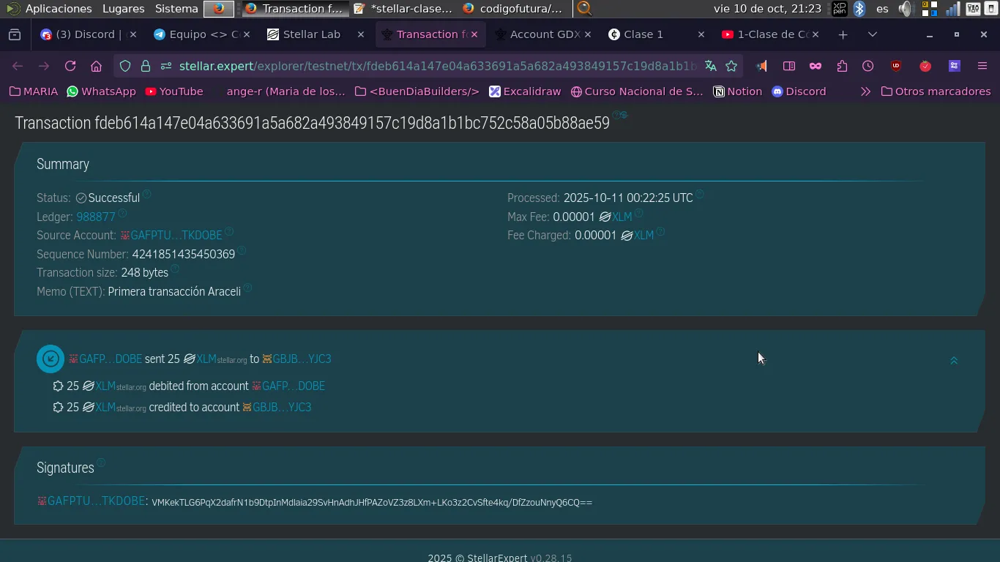

═══════════════════════════════════════════════════
### TAREA #1: 💫 MI VIAJE EN STELLAR 💫
═══════════════════════════════════════════════════

**Nombre:** Maria de los Angeles Rechach

**Email:** angeles.rechach@gmail.com

**UserName de Telegram:** @ange-rch

**Tu wallet Freighter:** GDEN2ZDV4BFBSLQYWFNKLFWO7A4VIVEJMFZ76ZXJJE7IIKDUU455FEFY

═══════════════════════════════════════════════════
### PARTE 1: 👩🏻‍💻 PRÁCTICA TÉCNICA
═══════════════════════════════════════════════════

💸 ***TRANSACCIÓN A: Una compañera del Equipo 23***
──────────────────────────────────────────────────

🔄 ***TX #1: Primera transacción***

#️⃣ **Hash:** fdeb614a147e04a633691a5a682a493849157c19d8a1b1bc752c58a05b88ae59

📤 **De: Mi cuenta**    GAFPTUCB2K2EKHBRYJAFSX3WP77OJOJXSJFUQKFADBDERKLMBUTKDOBE       

📥 **Para: Araceli** GBJBNB4GPDPBEZHNYC7AQGOR4BQCRNELUEPIVPSZOVYSE7DIOH5LYJC3
Monto: 25 XLM
Fecha: 10/10/2025

💪 

═══════════════════════════════════════════════════
### PARTE 2: INVESTIGACIÓN CREATIVA 🤔🤓☝️
═══════════════════════════════════════════════════

***RELATO: "Stellar en Mi Mundo"***
──────────────────────────────────────────────────
### **Pagos Sin Fronteras: La Revolución de Stellar en la Indumentaria**

**PROBLEMA:**  
Las pymes de indumentaria en Argentina enfrentan el desafío de pagar a proveedores en Asia mediante transferencias bancarias lentas y costosas. Las comisiones pueden alcanzar entre el 2 % y el 5 % del monto total, además de las conversiones de divisas y demoras que afectan la producción y reducen la competitividad.

**SOLUCIÓN CON STELLAR:**  
Implementar una plataforma de pagos basada en Stellar permitiría realizar transacciones directas, rápidas y seguras con proveedores internacionales. Mediante tokens estables, se eliminarían los costos de conversión y las demoras bancarias, asegurando pagos inmediatos y transparentes.

**BENEFICIOS:**  
Las comisiones de Stellar son mínimas frente a los métodos tradicionales, generando un ahorro económico significativo. Además, permitiría reducir hasta un 20 % el tiempo administrativo destinado a la gestión de pagos internacionales, liberando recursos humanos para tareas estratégicas. Su velocidad de transacción optimiza la relación con proveedores y mejora la capacidad de respuesta ante la demanda. La trazabilidad de la blockchain brinda seguridad y control total sobre las operaciones financieras, eliminando cargos por financiamiento y costos de gestión de divisas.

**IMPACTO:**  
Con Stellar, las pymes podrían destinar el dinero y tiempo ahorrados a ampliar su producción, invertir en innovación y ofrecer precios más competitivos. Esto fortalecería su posición en el mercado global y fomentaría la sostenibilidad del sector textil argentino. Stellar representa una herramienta concreta para modernizar los flujos financieros y potenciar el crecimiento económico de las empresas locales.

═══════════════════════════════════════════════════
### PARTE 3: REFLEXIÓN COMUNITARIA ✨💡🌟
═══════════════════════════════════════════════════

***REFLEXIÓN: STELLAR Y MI COMUNIDAD***

**PROBLEMA IDENTIFICADO:**  
En mi ciudad, la mitad de la población no cuenta con un trabajo formal, y muchos son migrantes que envían dinero a sus familias en el extranjero. Las altas comisiones de las transferencias internacionales y la falta de acceso a servicios bancarios los excluyen del sistema financiero.

**PROPUESTA CON STELLAR:**  
Desarrollar una aplicación que utilice la tecnología de Stellar para permitir transferencias rápidas y económicas. Esta podría usar tokens para facilitar la conversión de divisas y ofrecer servicios de ahorro y microcréditos, mejorando así la situación económica de los usuarios.

**BARRERAS A SUPERAR:**  
La educación financiera es un desafío clave. Se necesitarían campañas y capacitaciones para enseñar a la comunidad a usar la aplicación de manera segura, y generar confianza.

**CONCLUSIÓN:**  
Utilizar Stellar para mejorar la inclusión financiera es viable y tiene un gran potencial para simplificarles la tarea a las personas migrantes y mejorar su calidad de vida.
═══════════════════════════════════════════════════

👉🏻 NOTA: 
> Dentro de este repositorio, van a encontrar una sección de **"Ideas"**, donde reformulo y profundizo estas y otras que considero soluciones interesantes de aplicar.
>
> No quice modificar las entregas reales que hice en la fecha indicada, para poder ver reflejado los avances en mi proceso.

