# Mi idea con Stellar
## Aplicación barrial de intercambio de servicios con tokens 

***Concepto:***

*Una plataforma que conecta a los miembros de una comunidad o barrio, permitiéndoles intercambiar servicios mediante un sistema de tokens internos, sin necesidad de dinero tradicional. La aplicación combina geolocalización, roles de usuario diferenciados y elementos de gamificación, incentivando la participación activa y la colaboración entre vecinos.*

#### Funcionamiento

###### Roles de usuario:

- **Prestadores de servicio:** ofrecen sus habilidades o servicios (clases, reparaciones, limpieza, etc.).
- **Clientes:** consumen servicios y pueden a su vez ofrecer otros servicios.
- Un mismo usuario puede desempeñar ambos roles.

###### Sistema de pagos internos y tokens (función central):

> La base de la aplicación es que los usuarios **paguen y reciban servicios usando tokens**, que representan tiempo o esfuerzo, creando una **economía circular dentro de la comunidad**.

- **Flujo de pagos:**
  - Los **clientes** utilizan tokens para contratar servicios ofrecidos por prestadores.
  - Los **prestadores de servicio** reciben tokens como pago y pueden utilizarlos para contratar otros servicios o acumularlos como recompensa.
- **Tokens:**
  - Representan tiempo o esfuerzo, no dinero. Por ejemplo, 1 token = 1 hora de servicio.
  - Sirven como **moneda interna** para todas las interacciones dentro de la app.

###### Gamificación e incentivos:

- Se premia la constancia y la interacción mediante **recompensas en tokens, niveles o insignias**.
- Tanto clientes como prestadores pueden recibir recompensas por:
  - Llegar a cierto nivel de actividad dentro de la app.
  - Dar recomendaciones a otros usuarios.
  - Recibir recomendaciones o feedback positivo de otros usuarios.
  - Contratar múltiples servicios o más de un servicio por mes.
  - Ampliar su cartera de servicios (solo prestadores).
- Los usuarios pueden ver su **historial de tokens, logros y reputación**, fomentando la participación continua y la colaboración dentro de la comunidad.

###### Intercambio de servicios:

> Los tokens permiten intercambiar servicios entre vecinos: alguien ofrece algo a cambio de los tokens acumulados.
>
> Esto facilita un sistema de intercambio justo dentro de la comunidad.

###### Posible evolución a dinero real:

> En una etapa avanzada, se podría implementar un puente opcional para convertir tokens a XLM o a moneda tradicional, pero no es necesario para el funcionamiento principal del sistema.

#### Valor agregado:

- Fomenta la colaboración y el sentido comunitario.
- Crea un sistema de intercambio flexible y justo basado en tiempo y esfuerzo.
- Incentiva la participación mediante gamificación y recompensas visibles.
- Es una forma de digitalizar la economía local sin depender de dinero real.

## Desafíos de implementación de la aplicación barrial

Implementar esta aplicación a nivel barrial en distintas ciudades argentinas presenta varios desafíos que deben considerarse desde el inicio, tanto técnicos como sociales, y están directamente relacionados con el concepto de **intercambio de servicios con tokens** y gamificación.

1. **Educación y adopción tecnológica:**  
   - Muchos usuarios no están familiarizados con criptomonedas o tokens digitales. Será necesario **educar sobre Stellar**, cómo crear y manejar su cuenta, y cómo usar los tokens para pagar y recibir servicios.  
   - Algunos usuarios pueden tener poca experiencia digital, por lo que la interfaz debe ser **extremadamente intuitiva y accesible** para todas las edades, desde jóvenes hasta adultos mayores.

2. **Diversidad de usuarios:**  
   - La app debe funcionar tanto para personas jóvenes y técnicas como para adultos mayores con mínima experiencia digital.  
   - Esto incluye ofrecer **tutoriales claros, mensajes simplificados y soporte visual**, para que alguien que necesite un plomero o un servicio puntual pueda usarla sin problemas.

3. **Geolocalización:**  
   - La correcta ubicación de usuarios y servicios es fundamental para que los intercambios sean relevantes y prácticos.  
   - Desafíos incluyen: precisión de la ubicación, privacidad de datos y adaptación a distintos barrios con distintas densidades de población.

4. **Promoción y confianza:**  
   - Para que la comunidad adopte la app, será necesario generar **confianza en el sistema de tokens** y mostrar claramente los beneficios de participar.  
   - Estrategias de **publicidad local y comunicación clara** serán clave, destacando la seguridad de Stellar y la facilidad de uso.

5. **Diversidad de servicios y escalabilidad:**  
   - Gestionar una amplia variedad de servicios y prestadores requiere un sistema escalable y fácil de navegar.  
   - Mantener actualizado el catálogo de servicios y balances de tokens sin errores es crítico para la confianza en la app.

6. **Inclusión financiera y futuras funcionalidades:**  
   - Aunque el enfoque principal es el **intercambio de servicios con tokens**, a futuro se puede considerar agregar funcionalidades como **puentes opcionales a moneda real**, microcréditos o sistemas de ahorro internos basados en la reputación del usuario.  
   - Esto debe planificarse cuidadosamente para no complicar la adopción inicial y mantener la economía circular interna de la comunidad.

**Valor agregado de superar estos desafíos:**  
Si se logra implementar correctamente, la app puede **unir comunidades**, fomentar la colaboración y crear una economía barrial basada en confianza y tiempo, accesible para cualquier persona, sin importar edad o nivel digital.

```mermaid
graph TD
    A[Aplicación Barrial de Intercambio de Servicios con Tokens] --> B[Roles de Usuario]
    A --> C[Sistema de Pagos Internos]
    A --> D[Gamificación e Incentivos]
    A --> E[Intercambio de Servicios]
    A --> F[Posible Evolución a Dinero Real]
    A --> G[Desafíos de Implementación]

    B --> B1[Prestadores de Servicio]
    B --> B2[Clientes]
    B1 --> B1a[Ofrecen servicios: clases, reparaciones, limpieza]
    B2 --> B2a[Consumen servicios y pueden ofrecer otros]

    C --> C1[Clientes pagan con tokens]
    C --> C2[Prestadores reciben tokens]
    C1 --> C1a[Tokens representan tiempo o esfuerzo]
    C2 --> C2a[Bonificaciones por ampliar cartera de servicios y recibir feedback]

    D --> D1[Recompensas en tokens, niveles e insignias]
    D --> D2[Bonificaciones por recomendaciones y participación]
    D --> D3[Historial de tokens y reputación]

    E --> E1[Intercambio de servicios entre vecinos]
    E1 --> E1a[Economía circular dentro de la comunidad]

    F --> F1[Puente opcional a XLM o moneda tradicional]
    F --> F2[Microcréditos y ahorro basados en reputación]

    G --> G1[Educación y adopción tecnológica]
    G --> G2[Diversidad de usuarios]
    G --> G3[Geolocalización precisa y privacidad]
    G --> G4[Promoción y confianza en la app]
    G --> G5[Diversidad de servicios y escalabilidad]
    G --> G6[Inclusión financiera y futuras funcionalidades]
```

---
### 2️⃣ Mapa conceptual puro (segundo bloque)

```mermaid
graph TD
    A[Aplicación Barrial con Stellar] 
    A --> B[Roles de Usuario]
    A --> C[Economía con Tokens]
    A --> D[Gamificación e Incentivos]
    A --> E[Intercambio de Servicios]
    A --> F[Posible Evolución]
    A --> G[Desafíos]

    B --> B1[Prestadores de Servicio]
    B --> B2[Clientes]
    B1 --> B1a[Ofrecen servicios]
    B2 --> B2a[Contratan servicios / Recomiendan]

    C --> C1[Pagos internos con tokens]
    C --> C2[Bonificaciones por cartera y feedback]

    D --> D1[Niveles, insignias y recompensas]
    D --> D2[Historial de tokens y reputación]
    D --> D3[Bonificaciones por recomendaciones y participación]

    E --> E1[Intercambio entre vecinos]
    E1 --> E1a[Economía circular interna]

    F --> F1[Puente a XLM o moneda tradicional]
    F --> F2[Microcréditos y ahorro interno]

    G --> G1[Educación tecnológica]
    G --> G2[Diversidad de usuarios]
    G --> G3[Geolocalización precisa y privacidad]
    G --> G4[Promoción y confianza en la app]
    G --> G5[Escalabilidad y diversidad de servicios]
    G --> G6[Inclusión financiera y futuras funcionalidades]
```

