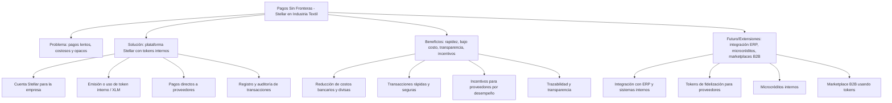
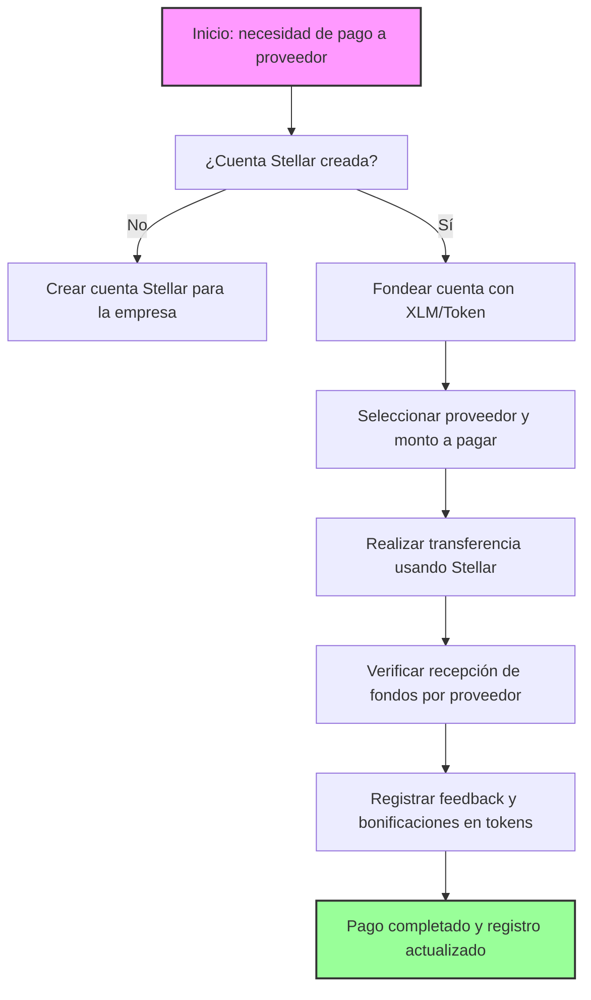

# Pagos Sin Fronteras: Stellar para la Industria Textil

## Concepto

*Una plataforma basada en Stellar que permite a empresas de indumentaria en Argentina gestionar pagos a proveedores internacionales y locales de manera rápida, transparente y económica. La idea no solo reemplaza transferencias tradicionales, sino que crea un ecosistema financiero interno que optimiza la cadena de suministro y fortalece la competitividad.*

---

## Funcionamiento

### Problemas que resuelve
- Altos costos y demoras en transferencias bancarias internacionales.
- Complejidad en conversiones de divisas.
- Falta de transparencia en pagos a proveedores y en la trazabilidad de la cadena de suministro.

### Solución con Stellar
- Cada empresa crea su cuenta Stellar y puede emitir un **token interno** o usar XLM para pagos.
- Los pagos a proveedores se realizan **directamente y en tiempo real**, sin intermediarios ni conversiones complicadas.
- La plataforma permite registrar transacciones, generar reportes y auditar pagos, asegurando **transparencia y control**.
- Se puede integrar con wallets existentes o aplicaciones de gestión de la empresa para automatizar pagos y conciliaciones.

### Flujo de pagos
1. Empresa emite o carga tokens/XLM en su cuenta Stellar.
2. Selecciona proveedor y monto a pagar.
3. Realiza la transferencia directa usando Stellar.
4. Proveedor recibe los fondos al instante.
5. La plataforma registra automáticamente la transacción y actualiza balances internos.

---

## Sistema de pagos internos y tokens (función central)

> Los tokens representan valor de manera flexible: pueden reflejar pagos reales, créditos internos o incentivos a proveedores por eficiencia y fidelidad.

- **Roles y pagos:**
  - Empresa: utiliza tokens para pagar proveedores y registrar gastos internos.
  - Proveedor: recibe tokens que pueden ser usados para pagos internos, compras futuras o convertidos a XLM opcionalmente.
- **Bonificaciones / incentivos:**
  - Proveedores que cumplen tiempos de entrega o estándares de calidad pueden recibir tokens extra.
  - Empresas que integren más proveedores o amplíen la red de producción interna reciben recompensas en tokens por eficiencia y trazabilidad.
  - Transparencia en comentarios o feedback de cada transacción para fomentar confianza y reputación.

---

## Valor agregado

- Reducción de costos en transferencias y conversiones de divisas.
- Mayor velocidad y eficiencia en pagos internacionales y locales.
- Transparencia total y trazabilidad en la cadena de suministro.
- Incentivos para mejorar cumplimiento y eficiencia de proveedores.
- Posibilidad de reinvertir ahorro en expansión, desarrollo de productos o digitalización de procesos.

---

## Futuro / Extensiones

- Integración con sistemas administrativos internos y ERPs de la empresa textil.
- Emisión de **tokens internos de fidelización** para proveedores frecuentes.
- Microcréditos internos o pagos fraccionados basados en reputación y desempeño de proveedores.
- Extensión hacia marketplaces B2B donde los tokens sirvan como medio de pago dentro de la industria.

---

## Desafíos de implementación de “Pagos Sin Fronteras” en la industria textil

Implementar esta plataforma basada en Stellar para la industria textil argentina presenta varios desafíos que deben considerarse desde el inicio, tanto técnicos como sociales y operativos, directamente relacionados con la adopción de pagos con tokens internos y transacciones internacionales.

1. **Educación y adopción tecnológica:**  
   - Proveedores y empresas deben familiarizarse con **Stellar, wallets y tokens digitales**.  
   - Es necesario crear **tutoriales claros, guías paso a paso y soporte visual**, especialmente para proveedores con poca experiencia digital.

2. **Diversidad de actores en la cadena de suministro:**  
   - La plataforma debe funcionar tanto para grandes proveedores tecnológicos como para talleres pequeños o locales que operen de manera tradicional.  
   - Se requiere **interfaz intuitiva, multilingüe y accesible**, adaptada a distintos niveles de digitalización.

3. **Gestión de pagos internacionales y conversión de divisas:**  
   - Garantizar que las transacciones sean **rápidas, seguras y de bajo costo**, minimizando riesgos de error o retraso.  
   - Considerar aspectos regulatorios y fiscales relacionados con pagos internacionales y uso de criptomonedas.

4. **Transparencia y trazabilidad:**  
   - Registrar y auditar todas las transacciones para **mantener confianza** entre empresas y proveedores.  
   - Establecer métricas de desempeño y mecanismos de feedback para incentivar cumplimiento y calidad en la cadena de suministro.

5. **Escalabilidad y diversidad de servicios:**  
   - La plataforma debe soportar un **número creciente de proveedores y transacciones**, sin pérdida de rendimiento.  
   - Mantener actualizados balances de tokens, pagos y bonificaciones de manera confiable y automatizada.

6. **Integración con sistemas internos y futuros desarrollos:**  
   - Conectar Stellar con **ERPs o sistemas administrativos internos** para automatizar pagos recurrentes y conciliaciones.  
   - Planificar futuras funcionalidades como **tokens de fidelización, microcréditos internos o marketplace B2B**, sin complicar la adopción inicial.

**Valor agregado de superar estos desafíos:**  
Si se implementa correctamente, la plataforma no solo agiliza pagos internacionales y locales, sino que también **fortalece la cadena de suministro textil**, aumenta la competitividad de la empresa y permite optimizar costos, eficiencia y relaciones con los proveedores.

